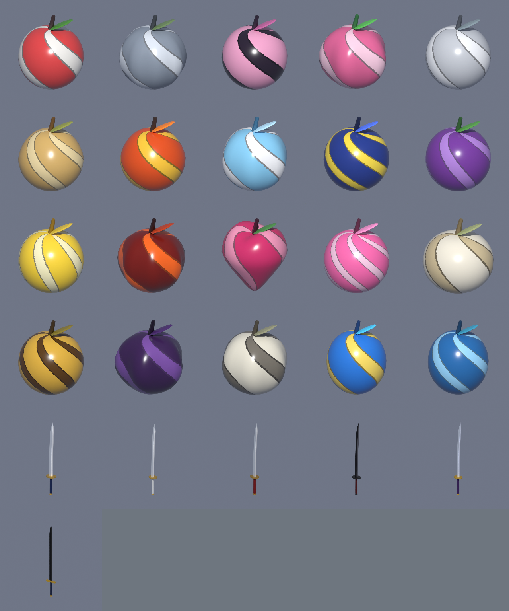

# One Piece fan game: assets

Companion to [`BLOX_FRUITS_MASTER_PROMPT.md`](../BLOX_FRUITS_MASTER_PROMPT.md).



`blender/rbx_asset_kit.py` builds the 20 canon Devil Fruits and 6 canon swords (Marine Saber, Wado Ichimonji,
Sandai Kitetsu, Shusui, Enma, Yoru) from the Content Bible, entirely in code.
It checks triangle budgets, renders previews and exports FBX for Roblox.

```bash
pip install bpy                     # or use the Blender app: blender -b -P blender/rbx_asset_kit.py -- --asset all
python blender/rbx_asset_kit.py --asset all            # everything
python blender/rbx_asset_kit.py --asset fruit:gomu_gomu    # one asset
```

## Import into Roblox
1. Studio → **Avatar/Home → Import 3D** → pick `blender/exports/<Asset>.fbx`.
2. Set **File Dimensions = Studs** and import (the texture is embedded).
3. Optional: add a `SurfaceAppearance` with `ColorMap` = `T_<Asset>.png` for extra gloss control.
4. For a held fruit or sword, put the MeshPart in a `Tool` as `Handle`. The origin is the grip, and the blade
   points up (+Y).
